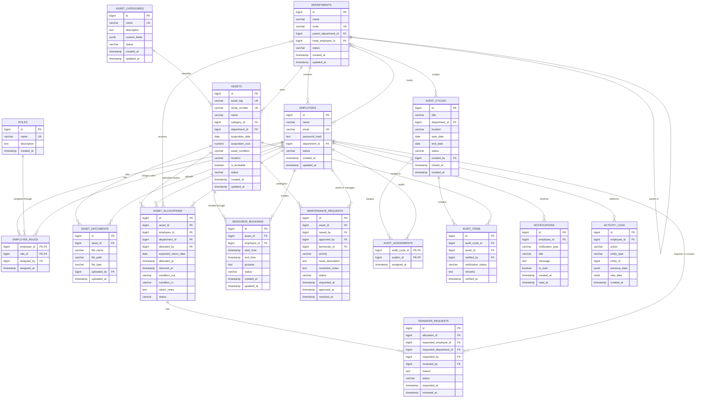

# AssetFlow — ER Diagram and Database Schema Design

## 1. Overview

AssetFlow is an Enterprise Asset and Resource Management System that helps organizations:

- Register and track physical assets
- Allocate assets to employees or departments
- Prevent duplicate asset allocation
- Transfer and return allocated assets
- Book shared resources without time conflicts
- Manage maintenance approval workflows
- Conduct structured asset audits
- Generate notifications and activity logs
- Track the complete lifecycle of every asset

The database is designed using PostgreSQL because AssetFlow contains strongly related business entities, transactional workflows, conflict-prevention rules and audit requirements.

The schema is based on the AssetFlow hackathon requirements, including secure role assignment, asset lifecycle tracking, booking-overlap prevention, maintenance approval, audit cycles and notifications. :contentReference[oaicite:0]{index=0}

---

## 2. Database Design Goals

The database is designed to provide:

1. **Data integrity** through foreign keys, checks and unique constraints
2. **Conflict prevention** for allocations and resource bookings
3. **Complete history** for allocation, transfer, maintenance and audit activity
4. **Secure role management** without self-assigned administrative roles
5. **Transaction safety** for multi-table workflows
6. **Efficient search and filtering** through appropriate indexes
7. **Scalability** through normalized and modular tables
8. **Traceability** through notifications and activity logs

---

## 3. Main Modules

| Module | Main Tables |
|---|---|
| Authentication and RBAC | `employees`, `roles`, `employee_roles` |
| Organization Setup | `departments`, `asset_categories` |
| Asset Management | `assets`, `asset_documents` |
| Allocation and Transfer | `asset_allocations`, `transfer_requests` |
| Resource Booking | `resource_bookings` |
| Maintenance | `maintenance_requests` |
| Asset Auditing | `audit_cycles`, `audit_assignments`, `audit_items` |
| Communication | `notifications` |
| Traceability | `activity_logs` |

---

## 4. ER Diagram



---

## 5. Role Management Design

AssetFlow uses the following roles:

- `ADMIN`
- `ASSET_MANAGER`
- `DEPARTMENT_HEAD`
- `EMPLOYEE`

A newly registered user receives only the `EMPLOYEE` role.

Users cannot select administrative roles during signup. An authorized Admin assigns additional roles through the Employee Directory.

The `employee_roles` junction table is used instead of a single role column because one employee may perform multiple responsibilities.

Example:

```text
Priya
├── EMPLOYEE
└── DEPARTMENT_HEAD
```

This design makes the RBAC system more flexible and scalable.

---

## 6. Department Hierarchy

The `departments` table contains a self-referencing foreign key:

```sql
parent_department_id BIGINT REFERENCES departments(id)
```

This allows hierarchical organization structures:

```text
Engineering
├── Software Development
├── Quality Assurance
└── Infrastructure
```

The `head_employee_id` field identifies the employee responsible for a department.

A department may temporarily have no head, so this field is nullable.

---

## 7. Asset Lifecycle

Supported asset statuses:

```text
AVAILABLE
ALLOCATED
RESERVED
UNDER_MAINTENANCE
LOST
RETIRED
DISPOSED
```

### Valid example transitions

```text
AVAILABLE → ALLOCATED
AVAILABLE → RESERVED
AVAILABLE → UNDER_MAINTENANCE

ALLOCATED → AVAILABLE
ALLOCATED → UNDER_MAINTENANCE

RESERVED → AVAILABLE
RESERVED → ALLOCATED

UNDER_MAINTENANCE → AVAILABLE

AVAILABLE → LOST
AVAILABLE → RETIRED
RETIRED → DISPOSED
```

Invalid transitions are rejected by the service layer.

The database uses a `CHECK` constraint to reject unknown status values.

---

## 8. Asset Allocation Design

The `asset_allocations` table stores both current and historical allocations.

An allocation may target either:

- An employee, or
- A department

It must not target both simultaneously.

```sql
CHECK (
    (employee_id IS NOT NULL AND department_id IS NULL)
    OR
    (employee_id IS NULL AND department_id IS NOT NULL)
)
```

### Preventing double allocation

An asset can have many historical allocation records but only one active allocation.

```sql
CREATE UNIQUE INDEX uq_active_asset_allocation
ON asset_allocations(asset_id)
WHERE status = 'ACTIVE';
```

This is a **partial unique index**.

It guarantees that PostgreSQL cannot store two active allocation records for the same asset.

---

## 9. Allocation Transaction

Asset allocation is executed inside a transaction.

```text
BEGIN
  ↓
Lock asset record
  ↓
Verify asset status is AVAILABLE
  ↓
Create active allocation
  ↓
Update asset status to ALLOCATED
  ↓
Create activity log
  ↓
Create notification
COMMIT
```

The selected asset is locked using:

```sql
SELECT id, status
FROM assets
WHERE id = $1
FOR UPDATE;
```

Row locking prevents two concurrent requests from allocating the same asset simultaneously.

If any step fails:

```text
ROLLBACK
```

No partial or inconsistent data is stored.

---

## 10. Asset Return Workflow

When an asset is returned:

1. The active allocation is locked.
2. Return condition and notes are recorded.
3. Allocation status becomes `RETURNED`.
4. `returned_at` is recorded.
5. Asset status becomes `AVAILABLE`.
6. Activity and notification records are created.

Overdue status is not stored permanently.

It is calculated dynamically:

```sql
SELECT *
FROM asset_allocations
WHERE status = 'ACTIVE'
  AND expected_return_date < CURRENT_DATE;
```

This avoids stale or duplicated overdue information.

---

## 11. Transfer Workflow

Transfer statuses:

```text
REQUESTED
APPROVED
REJECTED
CANCELLED
```

Workflow:

```text
Current allocation
      ↓
Transfer requested
      ↓
Asset Manager or Department Head reviews
      ↓
Approved or Rejected
```

When approved, the system performs one transaction:

```text
Old allocation → TRANSFERRED
New allocation → ACTIVE
Asset remains → ALLOCATED
Notification created
Activity history recorded
```

---

## 12. Resource Booking Design

Only assets with:

```text
is_bookable = TRUE
```

can be booked.

Every booking must satisfy:

```sql
CHECK (start_time < end_time)
```

### Time-overlap rule

A conflict exists when:

```text
existing_start < requested_end
AND
existing_end > requested_start
```

Example:

```text
Existing booking: 09:00–10:00
Requested booking: 09:30–10:30
Result: Rejected
```

```text
Existing booking: 09:00–10:00
Requested booking: 10:00–11:00
Result: Allowed
```

### PostgreSQL-level overlap protection

PostgreSQL can enforce the rule using an exclusion constraint:

```sql
CREATE EXTENSION IF NOT EXISTS btree_gist;

ALTER TABLE resource_bookings
ADD CONSTRAINT prevent_resource_booking_overlap
EXCLUDE USING gist (
    asset_id WITH =,
    tstzrange(start_time, end_time, '[)') WITH &&
)
WHERE (status IN ('UPCOMING', 'ONGOING'));
```

`[)` means:

- Start time is included
- End time is excluded

Therefore, a booking ending at 10:00 does not conflict with another booking starting at 10:00.

This database constraint protects the system even if two booking requests arrive concurrently.

---

## 13. Maintenance Workflow

Maintenance statuses:

```text
PENDING
APPROVED
REJECTED
TECHNICIAN_ASSIGNED
IN_PROGRESS
RESOLVED
```

Workflow:

```text
Employee raises request
        ↓
PENDING
        ↓
Asset Manager reviews
   ↙             ↘
REJECTED       APPROVED
                    ↓
          TECHNICIAN_ASSIGNED
                    ↓
              IN_PROGRESS
                    ↓
                RESOLVED
```

When maintenance is approved:

```text
Asset status → UNDER_MAINTENANCE
```

When maintenance is resolved:

```text
Asset status → AVAILABLE
```

The approval and resolution operations use transactions to keep the maintenance request and asset status synchronized.

---

## 14. Audit Cycle Design

An audit is represented using three tables:

### `audit_cycles`

Stores the overall audit:

- Scope
- Department
- Location
- Start and end dates
- Status
- Created by
- Closed time

### `audit_assignments`

Connects auditors to an audit cycle.

This is a many-to-many relationship because:

- One cycle may have multiple auditors.
- One employee may audit multiple cycles.

### `audit_items`

Stores the verification result for every asset.

Possible verification statuses:

```text
PENDING
VERIFIED
MISSING
DAMAGED
```

A discrepancy report is generated from:

```sql
SELECT *
FROM audit_items
WHERE audit_cycle_id = $1
  AND verification_status IN ('MISSING', 'DAMAGED');
```

A separate discrepancy table is unnecessary because the discrepancy data already exists in `audit_items`.

When an audit cycle is closed:

- Further modifications are blocked.
- Confirmed missing assets may be changed to `LOST`.
- The closing action is recorded in `activity_logs`.

---

## 15. Notifications

Notifications are created for events such as:

- Asset assigned
- Asset returned
- Transfer requested
- Transfer approved or rejected
- Booking confirmed
- Booking cancelled
- Booking reminder
- Maintenance approved or rejected
- Overdue return detected
- Audit discrepancy found

Each notification contains:

```text
Recipient
Notification type
Title
Message
Read status
Creation time
Read time
```

The initial hackathon implementation uses in-app notifications.

Email delivery can be introduced later without changing the main schema.

---

## 16. Activity Logging

The `activity_logs` table records:

- Who performed the action
- What action was performed
- Which entity was affected
- Previous data
- New data
- When the action occurred

Example:

```json
{
  "action": "ASSET_ALLOCATED",
  "entity_type": "ASSET",
  "entity_id": 14,
  "previous_data": {
    "status": "AVAILABLE"
  },
  "new_data": {
    "status": "ALLOCATED",
    "employee_id": 8
  }
}
```

`JSONB` is used for previous and new data because different entities have different structures.

The main relational data remains normalized.

---

## 17. Important Constraints

| Rule | Database Protection |
|---|---|
| Employee email must be unique | `UNIQUE(email)` |
| Asset tag must be unique | `UNIQUE(asset_tag)` |
| Serial number must be unique | `UNIQUE(serial_number)` |
| Acquisition cost cannot be negative | `CHECK (acquisition_cost >= 0)` |
| Booking start must precede booking end | `CHECK (start_time < end_time)` |
| One active allocation per asset | Partial unique index |
| Allocation must target employee or department | `CHECK` constraint |
| Unknown statuses are rejected | Status `CHECK` constraints |
| Invalid relationships are rejected | Foreign keys |
| Booking overlaps are blocked | Exclusion constraint |

---

## 18. Delete Behaviour

Delete rules are chosen carefully.

| Relationship | Delete behaviour | Reason |
|---|---|---|
| Department → Employee | `SET NULL` or block deactivation | Employee history should remain |
| Category → Asset | `RESTRICT` | Category in use must not be deleted |
| Asset → Allocation | `RESTRICT` | Allocation history must remain |
| Asset → Booking | `RESTRICT` | Booking history must remain |
| Asset → Maintenance | `RESTRICT` | Maintenance history must remain |
| Audit Cycle → Audit Items | `CASCADE` before cycle begins | Child items belong only to cycle |
| Employee → Activity Log | `SET NULL` | Log remains after employee deactivation |

Business records should normally be **deactivated**, not physically deleted.

---

## 19. Indexing Strategy

Indexes are added to frequently searched, filtered and joined columns.

```sql
CREATE INDEX idx_employees_department
ON employees(department_id);

CREATE INDEX idx_assets_category
ON assets(category_id);

CREATE INDEX idx_assets_department
ON assets(department_id);

CREATE INDEX idx_assets_status
ON assets(status);

CREATE INDEX idx_assets_location
ON assets(location);

CREATE INDEX idx_allocations_employee
ON asset_allocations(employee_id);

CREATE INDEX idx_allocations_expected_return
ON asset_allocations(expected_return_date)
WHERE status = 'ACTIVE';

CREATE INDEX idx_bookings_asset_time
ON resource_bookings(asset_id, start_time, end_time);

CREATE INDEX idx_maintenance_asset_status
ON maintenance_requests(asset_id, status);

CREATE INDEX idx_notifications_employee_unread
ON notifications(employee_id, is_read);

CREATE INDEX idx_activity_entity
ON activity_logs(entity_type, entity_id);
```

Indexes are not added to every column because excessive indexes increase insert and update cost.

---

## 20. Normalization

The schema follows approximately Third Normal Form.

### Examples

- Role names are stored once in `roles`.
- Category names are stored once in `asset_categories`.
- Department information is not repeated in every employee record.
- Allocation history is separated from the asset master record.
- Booking history is stored separately.
- Maintenance history is stored separately.
- Audit assignments use a junction table.
- Notifications and logs are independent modules.

This reduces:

- Duplicate data
- Update anomalies
- Deletion anomalies
- Inconsistent values

---

## 21. Security Considerations

- Passwords are stored only as secure hashes.
- Signup cannot assign elevated roles.
- Admin permissions are validated by the backend.
- SQL queries use parameterized placeholders.
- Sensitive database credentials are stored in `.env`.
- `.env` is excluded from Git.
- Backend ownership checks protect update and approval operations.
- Activity logs record sensitive administrative actions.
- Frontend role checks are used for usability, not as the only security layer.

---

## 22. Repository Architecture

```text
React Frontend
      ↓
Express Routes
      ↓
Controllers
      ↓
Services
      ↓
Repositories
      ↓
PostgreSQL
```

### Responsibilities

- **Routes:** Define endpoints and middleware
- **Controllers:** Receive requests and return responses
- **Services:** Apply business rules and transactions
- **Repositories:** Execute parameterized SQL
- **PostgreSQL:** Enforce final data integrity

Controllers must not contain raw SQL.

Repositories must not contain UI or HTTP-response logic.

---

## 23. Implementation Priority

### Phase 1 — Foundation

- Roles
- Departments
- Employees
- Categories
- Assets

### Phase 2 — Core workflow

- Allocation
- Return
- Transfer
- Double-allocation prevention

### Phase 3 — Resource and maintenance workflows

- Booking
- Overlap prevention
- Maintenance approval
- Asset status transitions

### Phase 4 — Audit and communication

- Audit cycles
- Audit assignments
- Audit items
- Notifications
- Activity logs

### Phase 5 — Analytics

- Asset availability
- Active allocations
- Overdue returns
- Active bookings
- Maintenance requests
- Audit discrepancies

---

## 24. Key Database Decisions

### Why PostgreSQL?

PostgreSQL provides:

- Reliable transactions
- Row-level locking
- Foreign-key enforcement
- Partial indexes
- Range types
- Exclusion constraints
- JSONB for audit metadata
- Strong aggregation and reporting capabilities

### Why store allocation history separately?

An asset may be allocated many times throughout its lifecycle. Storing allocation details inside the asset table would overwrite previous ownership information.

### Why calculate overdue allocations dynamically?

An overdue flag changes with time. Storing it permanently could become stale. It is safer to calculate it using the expected return date.

### Why use an exclusion constraint for bookings?

Application-level checks alone may fail during concurrent requests. PostgreSQL-level conflict prevention guarantees that overlapping bookings cannot be inserted.

### Why use transactions?

Actions such as allocation, transfer, maintenance approval and audit closure update multiple tables. Transactions guarantee that either every required update succeeds or none of them are saved.

---

## 25. Team Ownership

| Member | Responsibility |
|---|---|
| Afrin | PostgreSQL schema, ER diagram, repositories, constraints, transactions and analytics |
| Ragathish | Express APIs, authentication, RBAC, service logic and validation |
| Akshaya | React frontend, responsive UI, forms, navigation and API integration |

---

## 26. Summary

The AssetFlow database is designed as a modular ERP foundation rather than a collection of independent CRUD tables.

Its important design strengths are:

- Secure role assignment
- Hierarchical departments
- Full asset lifecycle tracking
- Database-protected allocation conflicts
- Database-protected booking overlaps
- Transactional transfer and maintenance workflows
- Structured audit cycles
- Complete notification and activity history
- Efficient indexing and scalable relationships